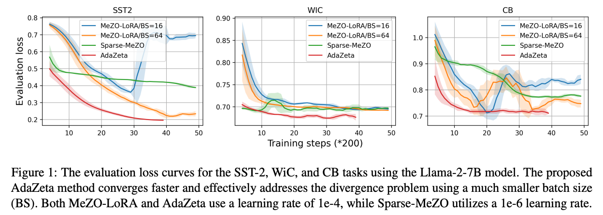

# Source Code for paper 'AdaZeta: Adaptive Zeroth-Order Tensor-Train Adaption for Memory-Efficient Large Language Models Fine-Tuning'
2024 Conference on Empirical Methods in Natural Language Processing (EMNLP 2024)

Yifan Yang (UCSB), Kai Zhen (Amazon AGI), Ershad Banijamali (Amazon AGI), Athanasios Mouchtaris (Amazon AGI), Zheng Zhang (UCSB)

---

This is the implementation for the paper [AdaZeta: Adaptive Zeroth-Order Tensor-Train Adaption for Memory-Efficient Large Language Models Fine-Tuning](https://arxiv.org/pdf/2406.18060).  In this paper, we propose the Adaptive Zeroth-order Tensor-Train Adaption (AdaZeta) framework, specifically designed to improve the performance and convergence of the ZO methods. To enhance
dimension-dependent ZO estimation accuracy, we introduce a fast-forward, low-parameter tensorized adapter. To tackle the frequently observed divergence issue in large-scale ZO finetuning tasks, we propose an adaptive query number schedule that guarantees convergence. Detailed theoretical analysis and extensive experimental results on Roberta-Large and Llama-2-7B models substantiate the efficacy of our AdaZeta framework in terms of accuracy, memory efficiency, and convergence speed.

<p align="center">
  
</p>


<h1> <p>🤗 News</p></h1>

**12/15/2024:** We update a distributed muti-queries ZO trainer for the large model experiments, which supports query distibuted on multi-GPUs and support transformers>4.40.

**10/21/2024:** First version of source code is released, feel free to reach out or open an issue if there is bugs in our code.

**09/20/2024:** Our paper 'AdaZeta: Adaptive Zeroth-Order Tensor-Train Adaption for Memory-Efficient Large Language Models Fine-Tuning'
has been accepted by the EMNLP 2024 main conference


## Key Environment Needed
-  **transformers==4.28.1 (for medium_model exps) / 4.40.0 (for large_model exps)**
- torch==2.3.0
- wandb
- loralib
- accelerate
- scikit-learn
- pandas
- datasets
- sentencepiece

A full list of required package is provided in the `requirements_med.txt` and `requirements_large.txt` files.

## Steps for Running _medium_models_ Experiments
- Install environment, specific version of torch and transformers are required for successfully running the code.
- Download and process data (same as MeZO code)

    Please run the following script to download, extract and process data:
    ```
  cd data
    bash download_dataset.sh          # Download and extract
    bash data_prep.sh                 # Process the data into 16/64-shot setup
  ```
- Example commands for AdaZeta and MeZO-LoRA are provided in `medium_models/run_all_bert_exp.sh`.
- To run different ZO fine-tuning methods, pay attention to the `MODE` and `TRAINER`

## Steps for Running _large_models_ Experiments
- Install environment, specific version of torch and transformers are required for successfully running the code.
- Example commands for AdaZeta and MeZO-LoRA are provided in `large_models/run_all_large_exp.sh`.

## Key Arguments Used
Lists of key arguments used in `medium_models/run_all_bert_exp.sh` and  `large_models/run_all_large_exp.sh`.

- `BS`: Batch size
- `LR`: Learning rate
- `STEPS`: Total training steps
- `RATE` & `SHRINK` & `NUM`: Constants used for adaptive query schedule (corresponding to $\alpha, \beta, Q_max$ in the paper)
- `TRAINER`: Choice between MeZO, AdaZeta, etc
- `MODE`: Inject different PEFT adapters, use `ft` for full model fine-tuning
- `TASK`: Different fine-tuning tasks
- `MODEL`: model name

## Insert Our Methods with Your Code?
The tensorized adapters and adaptive query schedule shown in our work can be easily integrated with any huggingface code:
- For tensorized adapters, we write our tensorized adapter code following the [PEFT](https://github.com/huggingface/peft) package. More detail about the design and implementation of our
tensorized adapters can be found in our previous LoRETTA work ([LoRETTA: Low-Rank Economic Tensor-Train Adaptation for Ultra-Low-Parameter Fine-Tuning of Large Language Models, NAACL 24](https://github.com/yifanycc/loretta)).
The tensorized adapters used in this paper is generally same as LoRETTA_Adp method, but freeze the layernorm during the fine-tuning.

- For the zeroth-order adaptive query schedule method, replace the official huggingface trainer with our `ZetaTrainer` in `large_models/trainer_adazeta.py`. Our trainer class is based on
the [MeZO Trainer](https://github.com/princeton-nlp/MeZO/blob/main/large_models/trainer.py) and the [Huggingface Trainer](https://github.com/huggingface/transformers/blob/v4.45.2/src/transformers/trainer.py#L290).

## (New) Multi-queries Distributed Training
We added the trainer file to suppport the multi-queries distributed trianing (You may need to do some modification on the main file to replace the old trainer). The multi-queries training distributes multiple ZO estmiation (RGE) on different GPUs and all-gather thereafter. The convergence speed of our AdaZeta method is further enhance after using the distributed training, which is more effective than enlarging the batch size. The new trainer file is in `large_models/trainer_dist_adazeta.py`. The main differnce compared with previous trainer is listed as follows:
- We fixed some bugs like loss-logging problem in previous trainer
- We offer a new `zo_dist_step` function, enable the distributed ZO estimiation and all_gather operation
- We modify the dataloader, to support multi-gpus estimation with same batch of data on different GPUs.

## Note
- The code is built based on the MeZO code in https://github.com/princeton-nlp/MeZO. We would like to express our gratitude for the publicly accessible resources provided by other researchers!

- If there is any problem, feel free to reach out `yifanyang@cs.ucsb.edu` or open an issue.

## Citation
If our work or code supports your research, we would greatly appreciate it if you could cite our related papers:

```angular2html
@article{yang2024adazeta,
  title={AdaZeta: Adaptive Zeroth-Order Tensor-Train Adaption for Memory-Efficient Large Language Models Fine-Tuning},
  author={Yang, Yifan and Zhen, Kai and Banijamal, Ershad and Mouchtaris, Athanasios and Zhang, Zheng},
  journal={arXiv preprint arXiv:2406.18060},
  year={2024}
}

@inproceedings{yang2024loretta,
  title={LoRETTA: Low-Rank Economic Tensor-Train Adaptation for Ultra-Low-Parameter Fine-Tuning of Large Language Models},
  author={Yang, Yifan and Zhou, Jiajun and Wong, Ngai and Zhang, Zheng},
  booktitle={Proceedings of the 2024 Conference of the North American Chapter of the Association for Computational Linguistics: Human Language Technologies (Volume 1: Long Papers)},
  pages={3161--3176},
  year={2024}
}
```

